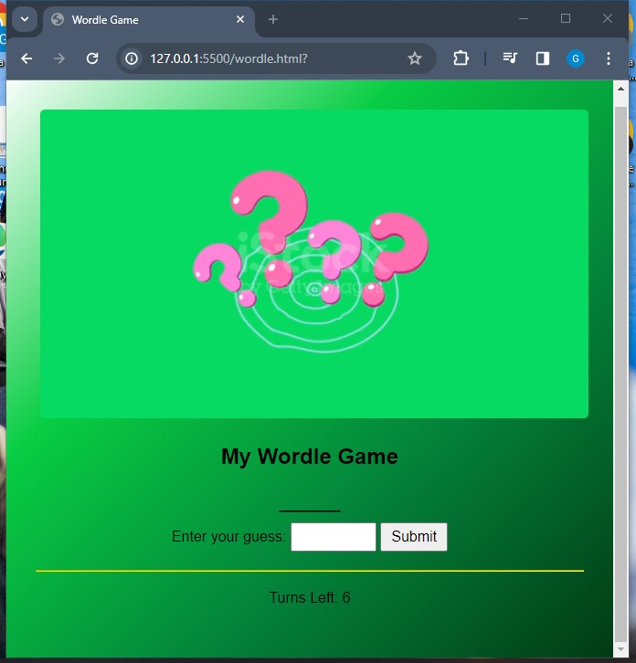
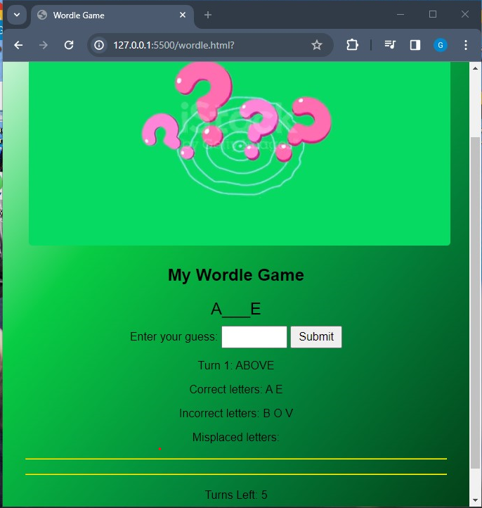
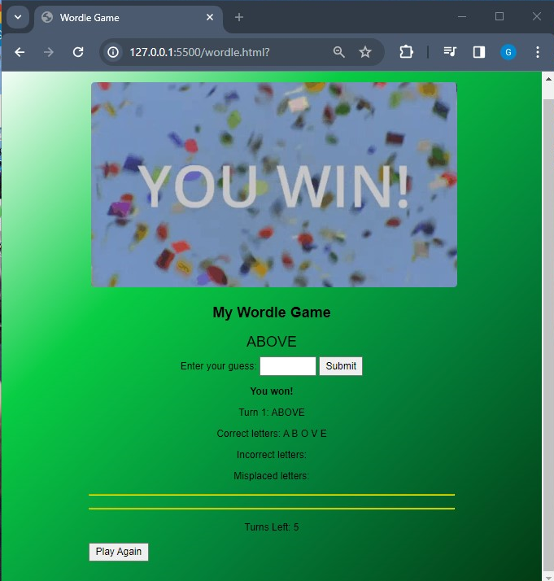
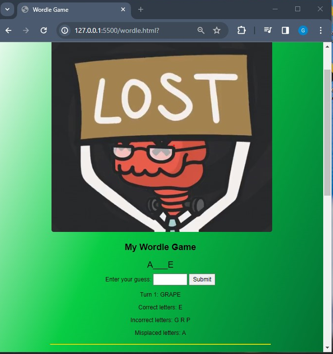

# wordle_clone_attempt
Attempt at recreating the game wordle. In which a user has 6 chances to guess a 5 letter word. This program makes use of python Rich to incoporate color on outputs.

   

  

DEMO:

